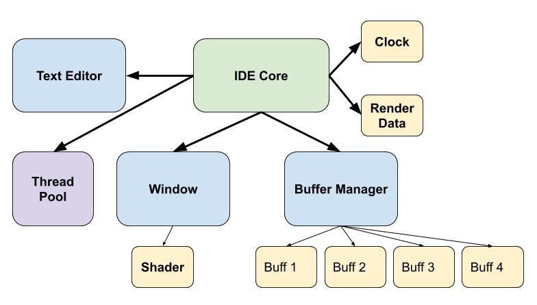

# Main IDE Architecture

*NOTE: This architecture is currently just an idea of how the "Saturn" IDE will process events. It has not been fully implemented yet, and will most likely change as more ideas arise.*  

The "Saturn" IDE needs to constantly deal with events. (ex: file read/write, buffer/tab editing, parsing, compilation, etc.) These events will be spread out to separate threads so that they can finish as fast as possible. The events also need to be processed in a way that keeps all data in sync so that nothing becomes corrupted by two threads writing to the same data. This multi-threaded architecture hopes to achieve that goal.  

## Current IDE Architecture

  
The architecture for "Saturn" is centered around the **Event**, as everything that happens in the IDE is followed by an **Event** created from the user's input. (ex: mouse click, keypress, etc.) Thus, the architecture is created to process these events as fast as possible, while keeping the UI experience smooth and synchronized.  

## IDE Architecture Process
This is what happens once every loop. The process is described in more detail [here](ide-arch-process.md).
- Rendering Synchronization
- Event Processing
- GPU Processing
- Wait for Threads
